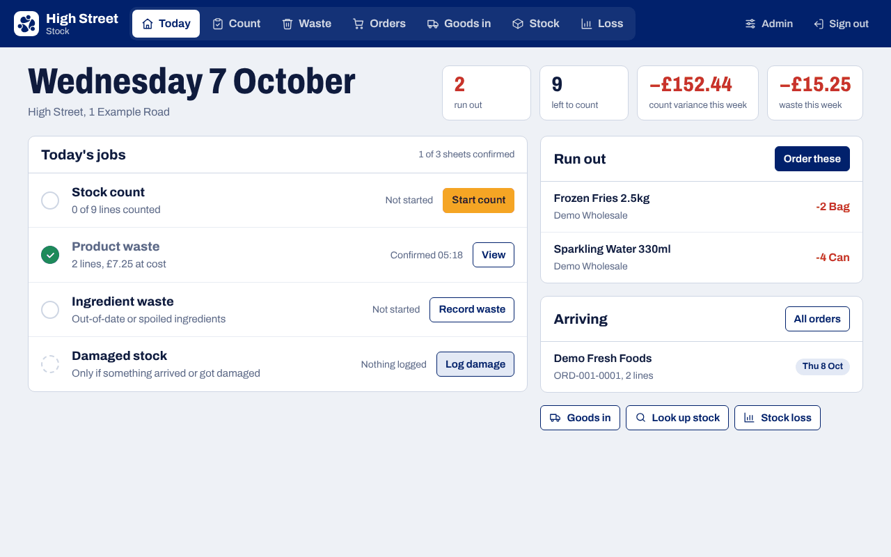

# MustrHQ Stock

[](https://github.com/MustrHQ/stock/releases/latest)
[](LICENSE)


Stock counting, waste recording and stock-loss reporting for shops and kitchens.
Plain PHP and MySQL — no framework, no Composer, no build step. Upload the folder to
cPanel shared hosting and it runs.

Part of the [MustrHQ](https://mustrhq.app) open-source set, alongside
[MustrHQ Rota](https://github.com/MustrHQ/rota) and [MustrHQ Recipes](https://github.com/MustrHQ/recipes).

<p align="center">
  
</p>

**Quick start:** download the latest zip from [Releases](https://github.com/MustrHQ/stock/releases/latest),
upload it to your hosting, open `install.php` and follow the wizard. Full details under [Install](#install).

## What it does

Two ways in:

**Shop view** (`/index.php`) — the tile launchpad a shop uses every day.

| Tile | What it is |
|---|---|
| Stock Count | The articles due to be counted today. Anything sitting in negative stock is pulled in automatically and shown in purple. |
| Ingredient Waste | Day sheet for ingredients, with date arrows to go back a day. |
| Product waste | Day sheet for what you sell, grouped by category, with a tick for anything given to charity. |
| Damaged stock | Write off items that arrived damaged, spoiled, or cannot be sold, with a reason. |
| Ordering | Build an order from suggested quantities, print it, then book in what arrives. |
| Goods In | Deliveries and shop-to-shop transfers, so expected stock is right. |
| Lookup Stock | Catalogue search, on-hand figure and movement history per article. |
| Stock loss | Variance and waste by product, category and date, as a share of net sales. |

**Admin panel** (`/admin/`) — articles, suppliers, par levels, the count schedule,
categories and units, shops, users, and the sales figures the report measures against.

## Install

The installer is a four-step wizard, the same shape as WordPress. There is no file to edit
by hand — it writes `config.php` for you.

1. In cPanel → **MySQL Databases**, create a database and a user, and add the user to the
   database with all privileges.
2. Upload the folder and open `install.php` in your browser.
3. **Before you start** — it checks your PHP version, the PDO MySQL extension and whether the
   folder is writable.
4. **Database** — your database name, user, password and host. The connection is tested before
   anything is written; if the folder is not writable it shows you the exact `config.php` to
   paste in instead.
5. **Your shop** — app name, currency, time zone, your first shop, your admin account, and
   whether to load example articles and suppliers.
6. **Done** — sign in, then **delete `install.php` from the server**.

Requires PHP 7.4 or newer with PDO MySQL. Nothing else.

### Demo data

Tick **Add demo data** on the last install step to try the app with a small, entirely fictional
takeaway menu — burgers, wraps, bowls, drinks and the ingredients and packaging behind them —
from three made-up suppliers, with four barcodes you can type in to test scanning
(`2000000000107`, `2000000000206` for a case of 24, `2000000000305`, `2000000000404`).
Those sit in the barcode range reserved for in-store use, so they will never match a real product.

When you are ready to go live, **Admin → Dashboard → Remove demo data** deletes it with all its
stock history, barcodes and orders. Your own articles are never touched: demo articles are
recognised by their `DEMO-` codes. If you skipped it at install, the same place offers to load it.

### Already running an earlier copy?

From 1.4 onwards, use **Admin → Updates & backups** instead — see *Updating* below.

#### Before 1.4

Replace the files, keep your `config.php`, and open `install.php`. It sees the existing
install and offers **Upgrade database** — that adds the supplier, par level and order tables
and leaves everything you already have alone.

## Ordering

Pick a supplier on the **Ordering** tile and the order builds itself:

```
par level set      order up to par           → (par − on hand)
no par level       cover recent sales        → (average daily sales × cover days) − on hand
                   cover days = supplier lead days + 3
then               round up to whole packs
```

You get a sheet with on-hand, suggested and an editable order column, so nothing is ordered
without someone looking at it. Add anything the suggestion missed, leave a note for the
supplier, then **Mark as sent** and print it.

**Print** gives a proper purchase order: your shop as the delivery address, supplier contact
block, the supplier's own product codes where you have set them, line and order values, a
tick box per line for the received quantity, and signature lines for picked / delivered /
received. It prints clean — no navigation, no buttons.

When the delivery turns up, open the order and **Receive into stock**. Type a figure only
against lines that came up short; everything else is taken as delivered in full. Each line
posts a delivery movement, so short deliveries show up in the count variance instead of
quietly disappearing. A manager can reverse a booked-in delivery, which removes the stock again.

Set who supplies what, the supplier's code for it, pack size and pack cost in
Admin → Articles. Par levels are per shop in Admin → Par levels, where a blank pack size
falls back to the article default.

## Barcode scanning

Anything with a barcode can be scanned instead of typed — typing still works everywhere.

**Three ways to scan**
- **Phone or tablet camera** — tap **Scan** on any sheet. Android uses the phone's built-in reader;
  iPhones and everything else use the bundled ZXing decoder. Needs HTTPS.
- **Handheld scanner** — any USB or Bluetooth scanner that acts as a keyboard. No setup: scan
  at any time on a sheet, even with the cursor sitting in a quantity box.
- **Typing the digits** under the barcode, in the scanner window.

**What a scan does**

| Page | Each scan… |
|---|---|
| Stock count | adds to that item's count. Scan 12 cans, get 12. Items not on today's sheet offer **Add it**. |
| Product / ingredient waste | adds to that item's waste line. |
| Order being received | adds to the received column — scan the delivery off the van. |
| Order being drafted, damaged stock, goods in | picks the item and fills the quantity. |
| Lookup stock | opens the item. |

**First time a barcode is seen** the system asks which article it is and how many units one scan
counts as — 1 for a single item, 24 for a case barcode. From then on it is recognised on every
device. Only managers and admins can teach barcodes; staff are asked to fetch a manager.
An article can have several barcodes (unit and case). UPC and EAN versions of the same code match.

To set up a stockroom in one go: **Admin → Barcodes → Start setup mode**, then scan product after
product. The same page lists every link, who made it, and lets you correct or remove one.

A camera read only counts again once the barcode has left the view, so holding an item under
the camera counts it once.

## The app

MustrHQ Stock installs as an app on phones, tablets and computers — same as the MustrHQ clock-in
kiosk. No app store: it is a Progressive Web App, so it installs from the browser, gets its own
icon, opens full-screen, and updates itself whenever you update the site.

- **Android / Chrome / Edge:** sign in, then tap **Install app** on the home screen card
  (or browser menu → *Install app*).
- **iPhone / iPad:** open the site in Safari → **Share** → **Add to Home Screen**.
- Long-press the icon for shortcuts straight to Stock count, Product waste, Ordering and Scan.

Supervisors do counts, waste and deliveries on the shop floor; owners open the same app from
anywhere to see every shop's sheets, loss report and orders. It is the same live site, so
there is nothing to sync.

**No signal in the stockroom?** Every number typed on a count or waste sheet is also kept on
the device. If the connection drops, keep counting — Save waits until there is signal, and a
closed tab or flat battery does not lose the count. The copy on the device is cleared only once
the server confirms it has the numbers.

HTTPS is required for installing and for the camera.

## Updating

**Admin → Updates & backups.** Upload the new release zip as downloaded:

1. It is checked first — right app, readable version, no unsafe paths. You see what is new,
   changed and unchanged before anything happens.
2. **Back up and install** zips the current files (and, by default, dumps the database) into
   `backups/`, then writes the new files. If any file cannot be written, the backup is put
   straight back.
3. The new version then upgrades the database — adding tables and columns, never changing data.

Never touched: `config.php`, `install.lock`, the installer, and `backups/`.

**Restore** on any file backup rolls back; the version you are leaving is backed up first.
**Download** backups to keep them off the server. Database backups restore through phpMyAdmin → Import.

If you would rather copy files up by FTP, that works too: the app notices the files are newer
than the database and upgrades it on the next page load.

The release zip must fit your host's upload limit, shown on the page (often 2 MB by default;
raise `upload_max_filesize` and `post_max_size` in cPanel → Select PHP Version → Options).

## When something runs out

Any article that drops to zero or below is flagged the moment it happens — whether a sale,
a waste sheet or a stock count took it there. It counts if the shop has ever stocked it or
it has a par level; catalogue lines the shop has never carried are left alone.

- **On sign-in** the home screen asks once: a prompt lists what has run out with its supplier,
  and offers **Review and order** or **Remind me later**. It asks again only when a new item runs out.
- **On every other page** a red strip under the top bar says how many items are out and links
  straight to them, until each one is on an order.
- **On the Ordering page** out-of-stock items are grouped by supplier with one button per
  supplier — **Add 3 to order** — which puts them on that supplier's draft at the suggested
  quantity, never less than one full pack.

Once an item is on a draft or sent order it stops nagging. If an article has no supplier set,
the panel says so and links an admin to fix it.

## Counting once, twice or three times a week

Admin → Count schedule is a grid of articles against the seven days. Tick the days each
article should appear on the sheet: expensive proteins every day, dry goods once a week,
packaging on Mondays. Tick several articles and use **Bulk set** to do a whole
group at once.

A schedule can apply to every shop (the default) or to one shop only — pick the shop in
the dropdown and the rows you save there override the default for that shop.

Negative stock ignores the schedule. If an article's on-hand figure drops below zero it is
added to the next count automatically and shown in purple, with the negative figure beside it.

## How the numbers work

Every quantity change is one row in `movements`, so stock on hand is just the sum of that
article's rows:

```
delivery        +qty      Goods In, or receiving an order
transfer        ±qty      Goods In
sale            −qty      Admin → Sales import
waste_stales    −qty      Product waste sheet
waste_ingredient −qty     Ingredient waste sheet
waste_quality   −qty      Damaged stock
count_adj       ±qty      posted when a count is confirmed
```

When a count is confirmed, each line records:

```
expected = sum of movements for that article up to the count date
variance = counted − expected
value    = variance × cost price
```

The variance is written back as a `count_adj` movement, which is what makes the on-hand
figure agree with what was actually on the shelf, and what the loss report adds up.

Loss is shown as a percentage of net sales (excluding VAT). Enter net sales by hand per day,
or import sales lines (`date, article code, qty, net value`) and the report derives it.

Reopening a confirmed sheet reverses everything it posted, so nothing double-counts.
Only managers and admins can reopen.

## Roles

- **Staff** — fill in and confirm sheets for their own shop.
- **Manager** — the above, plus reopening a confirmed sheet and deleting goods-in entries.
- **Admin** — the whole admin panel, and can switch between shops from the home page.

## Files

```
config-sample.php     settings template — the installer copies this to config.php
config.php            your settings (written by the installer, never in the repo)
bootstrap.php         loads settings, opens the database, small helpers
lib.php               auth, shop context, the stock ledger, schedule and order logic
inc/schema.php        every table, and the upgrade path for older installs
install.php           setup wizard (delete after running)
index.php             tile launchpad
stock-count.php       count sheet
ingredient-waste.php  \ both are thin wrappers around
product-waste.php     / inc/waste_sheet.php
damaged-stock.php
inc/demo.php          the fictional demo catalogue, and its remover
orders.php            order list and order builder
order.php             one order: edit, send, receive
order-print.php       printable purchase order
deliveries.php        goods in
lookup.php            catalogue and movement history
reports.php           stock loss
admin/                dashboard, articles, suppliers, par levels, schedule,
                      taxonomy, shops, users, sales
inc/icons.php         inline SVG icon set
inc/updater.php       zip updates, backups, rollback
api/barcode.php       barcode lookup and teaching
admin/barcodes.php    barcode list and setup mode
admin/update.php      updates and backups
assets/scan.js        camera, handheld scanners, teach flow
assets/vendor/        ZXing barcode decoder (Apache 2.0)
manifest.php, sw.php  the installable app
offline.html          shown when there is no connection
version.php           the release number
backups/              created by the updater; blocked from the web
assets/fonts/         IBM Plex Sans, self-hosted
docs/screenshots/     what each screen looks like
assets/app.css        one stylesheet
assets/app.js         table filter, article picker, unsaved-changes warning
```

## Design

MustrHQ Stock uses the same design as MustrHQ Recipes, so the products sit together on one
tablet or one owner's phone: MustrHQ navy (`#01216C`), the white logo tile with your shop's
name beside it, Archivo for all text (its condensed cut for codes and big figures), and
navy-outlined buttons. Amber is kept for the one thing to do next — on Today, the next job's
button; in the scanner, the frame.

Colour carries meaning and nothing else: green is confirmed, red is run out or lost, amber is
waiting. On count and waste sheets an empty line shows a dash and every number you type turns
navy, so you can see the sheet filling up as you count.

The admin uses the same navy sidebar as Recipes. On a phone it folds into a header with the
sections in a row underneath; the shop screens keep their tabs in the header.

One stylesheet, no framework. The font (SIL Open Font Licence) and logo files are bundled in
`assets/`, so nothing loads from a third-party server.

Screenshots are in `docs/screenshots/`.

## Security

**Accounts and sign-in**
- Passwords hashed with `password_hash()` and upgraded automatically if PHP's default gets stronger.
- Five wrong passwords for one email in 15 minutes locks that email out for 15 minutes; one
  address hammering many accounts is locked too. Failed sign-ins take the same time whether or
  not the account exists, so the form does not reveal who has an account.
- Sessions are regenerated at sign-in, cookies are `HttpOnly`, `SameSite=Lax`, and `Secure`
  whenever the site is on HTTPS. Staff are signed out after 4 idle hours (set `APP_IDLE_MINUTES`
  in `config.php` to change it). Disabling a user signs them out on their next click.
- Sign-out is a POST with a token, so a link on another site cannot sign staff out mid-count.

**Who can do what**
- Staff see only their own shop. The shop switcher only works for admins; orders, print-outs
  and sheets from another shop are refused. The admin panel returns 403 to anyone but admins.
  Reopening confirmed sheets and reversing deliveries needs a manager.

**Requests and output**
- Every form carries a CSRF token. All SQL is prepared; the few built strings are integers or
  fixed values. All output is escaped.
- Security headers on every page: content security policy (no scripts from other sites),
  clickjacking protection, `nosniff`, a strict referrer policy, and HSTS on HTTPS.

**Files and install**
- The installer locks itself with `install.lock` after it finishes and cannot be re-run over a
  live system — there is no override. The database upgrade only runs for a signed-in admin.
  Still delete `install.php` once you are set up.
- `config.php` is written with 0640 permissions, never committed, and blocked by `.htaccess`
  along with the other internals and the lock file.

**What you should still do**
- Put the site on HTTPS (free with AutoSSL in cPanel) — everything above assumes it.
- Back the database up nightly (cPanel → Backup, or a cron job).
- Give people the lowest role that does their job.

## Contributing

Bug reports, fixes and ideas are welcome — see [CONTRIBUTING.md](CONTRIBUTING.md).
Please report security issues privately, as described in [SECURITY.md](SECURITY.md).

## Licence

MustrHQ Stock is free software under the **GNU Affero General Public License v3.0** — see [LICENSE](LICENSE).

You can use, study, change and share it. If you run a modified copy that other people use over a
network, you must offer them the source of your version. The **Source code** link on the sign-in
page and in the admin footer is there for that: set `APP_SOURCE_URL` in `config.php` to wherever
your version's code lives.

Bundled third-party work: the ZXing barcode decoder (Apache License 2.0, `assets/vendor/ZXING-LICENSE.txt`)
and the Archivo typeface (SIL Open Font License 1.1, `assets/fonts/OFL-archivo.txt`).
